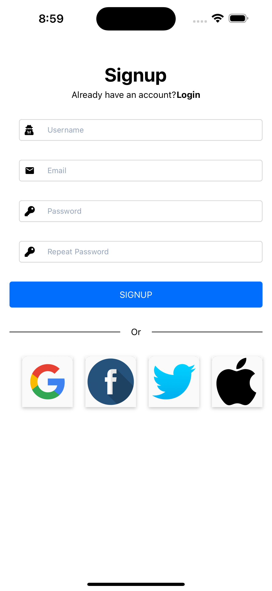

# AuthUI Example using React Native Expo

Basic UI/UX of a Login Page and Sign up Page using React Native with Expo. Feel free to use this
in your projects as it is ready to go.

## Screenshots

&nbsp; &nbsp; &nbsp; &nbsp;

## Requirements

- Node installed, see [installing node]() to get started.
- NPM installed, see [installing npm]() to get started.
- Expo installed, see [installing expo]() to get started.

## Getting Started

Create a new project to follow along on your own:

`expo init AuthUI --npm`

### React Navigation for Screens

`npm install @react-navigation/native`

`npm install react-native-screens react-native-safe-area-context`

`npm install @react-navigation/stack`

### Native Base for the UI

`npm install native-base`

`npm install react-native-svg`

`npm install react-native-safe-area-context`

`expo install react-native-gesture-handler`

### Vector Icons

`npm install @expo/vector-icons`

### Make sure everything is installed

`npm install`

## Run

`expo start`

## References

- [Signup UI Using React Native Expo (Part 1)](https://www.youtube.com/watch?v=zP5F9ITdMqg)
- [Signup UI Using React Native Expo (Part 2)](https://www.youtube.com/watch?v=JqYv4F-WujI)
